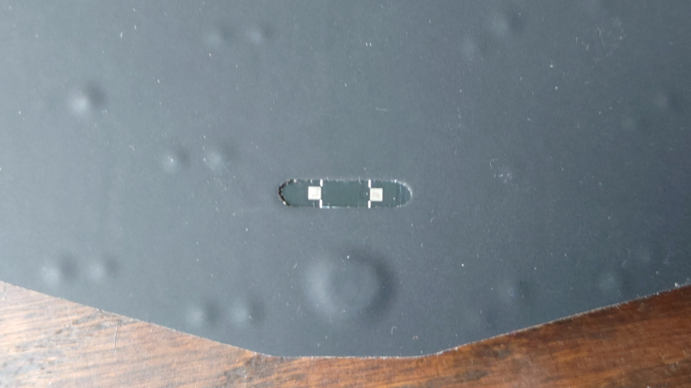

# Build guide

## Material

|Items                                                                                                      |Quantity|
|-----------------------------------------------------------------------------------------------------------|-------:|
|[Assembled PCB](pcb/gerbers/)                                                                              |       1|
|[Fat plate](cad)                                                                                           |       1|
|[0.5mm self adhesive silicone sheet](https://www.aliexpress.com/item/1005003938672544.html)                |       1|
|[Kailh Choc v1 switches](https://lowprokb.ca/collections/switches/products/ambients-silent-choc-switches)  |      36|
|[Choc spaced compatible keycaps](https://lowprokb.ca/collections/keycaps/products/ldsa-low-profile-blank-keycaps)|36|
|[USB-C cable](https://www.aliexpress.com/item/1005003058092715.html)                                       |       1|
|[Solder Wire](https://www.aliexpress.com/item/1005007053733373.html)                                       |      3g|
|Cardboard (as food packaging for example)                                                                  | 20×10cm|
|Pure isopropyl alcohol or ethanol (optional)                                                               |     5mL|

|Tools                                                                                   |
|----------------------------------------------------------------------------------------|
|[Soldering kit](https://www.aliexpress.com/item/4000019437594.html)                     |
|[12mm×3mm hole punch](https://www.aliexpress.com/item/1005005796385084.html) (or bigger)|
|Hammer                                                                                  |
|Scissors                                                                                |
|Utility knife                                                                           |
|School glue stick                                                                       |
|A cutting board not afraid of the hole punch and the utility knife                      |
|Black permanent marker (optional)                                                       |
|approx 6mm hole punch (paper or leather, optional)                                      |

## Prepare the silicone sheet (WiP)

cardboard jig

cut silicone sheet in keyboard sized pieces

make hole

## Solder switches

Before doing anything with the PCB, flash it as explained at the
[firmware page](firmware/), and test the keys by shorting the contacts
on the PCB.

If you want, you can paint the border of the PCB with a black
permanent marker.

Inspect the back of the plate for any asperity. You can sand the back
of the plate with a knife to be sure that any small imperfection is
sanded.

Then, Place all the switches on the plate. They should be easy to
put. If some are a bit mobile, that’s not a problem. Be sure to put
all of them in the good direction (pins at the opposite of the USB
pocket), and that all the pins are straight.

The plate should not be too warped. If the switches are difficult to
clip, they can bend the plate. In this case, better to sand the holes
a bit.

Place gently the plate over the PCB, inserting the pins in the PCB
holes. Be sure that no pin bend. Press firmly, to be sure that
everything is well placed. The metal pins should be just at the level
of the PCB.

For the switches on the corners, solder ONE pin, then press firmly the
switch to the PCB while reflowing the solder. This is to be sure the
plate touches the PCB.

Inspect that the plate touch the PCB on the sides. Repeat the
preceding procedure if it is not the case.

You can now solder all the pins. Be sure to put enough solder inside
the hole, and try to have a flush solder. You can remove excessive
solder with the soldering iron by capillarity. Ideally, the PCB should
be as flat as possible.

Test the keyboard, all the switches must be functional. If not, add
solder to the pins of the problematic pins, and stay 2 real seconds on
the solder to be sure the solder is well done.

Now that the soldering is finished, you can (but don’t need to) clean
the flux with IPA or another flux solvent. You can also use pure
ethanol, but don’t use acetone. Be careful to not put too much solvent
on the borders of the PCB or you might dissolve its painting (if you
have done it).

## Level the board

The PCB might not be completely flat, or the solder join might be a
bit high in some places. You don’t want your keyboard to be wobbly
while typing, so a bit of tuning is needed.

Put the soldered board on a flat surface (a desk for example). Press
on the empty space between the 2 thumb clusters. The board might move
a tiny bit.

Put a small disk of cardboard (done with the 6mm hole punch or with
scissors) between the PCB and the desk. It should be between the boot
connector and the edge of the PCB. Check, by repeating the previous
step, that the PCB doesn’t move anymore. Add as much as cardboard
circle as necessary. In case of doubt, better one more than one less.

On this photo, one layer was needed.

## Glue the silicone sheet

First, glue the leveling spacers with some school glue stick together,
and on the PCB, between the BOOT connectors and the edge. The glue is
only to keep them in place during the next operation.

Remove the protection foil of the previously prepared adhesive
silicone sheet. Align the BOOT hole with the BOOT connector, being
careful to not move the spacer. Then, press firmly from the center to
the borders, to avoid any bubble, and glue the silicone sheet. Bubbles
like to stay around the spacer, so be conscientious in this area. On
the other areas, the bubbles disappear around the switches.

Put the keyboard on the cutting board, and cut the excess of silicone
sheet with the utility knife. The blade should be angled, parallel to
the edge, touching the PCB. Cut in 4 steps: one for the top, one
for each side, and one for the bottom.

Your keyboard is ready! Enjoy!
