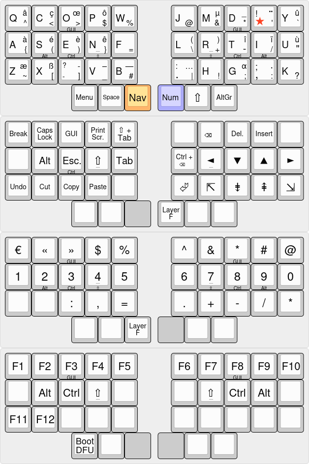

# Keymini, a minimalist ergonomic keyboard

> Perfection is achieved, not when there is nothing more to add, but
> when there is nothing left to take away. ― Antoine de Saint-Exupéry

## Presentation

Keymini is a monoblock ergonomic keyboard with 36 keys. It is as low as
possible (with Kailh Choc v1 switches). As it is flat on the underside,
it can be used placed on a laptop keyboard, without actuating the
laptop keyboard keys.

Keymini is a minimalist keyboard in a lot of way:
* Only a keyboard, no LED, no rotary encoder, no screen, not split, no
  hotswap… Just USB-C connector and keys.
* Minimal size, entering in a C5/6 envelope (3 fold A4) or a Nintendo
  Switch Lite case.
* Minimal number of keys, at 36, as popularized by
  [Miryoku](https://github.com/manna-harbour/miryoku).
* Minimal keyspacing, following the classical "choc spacing."
* Minimal height, with the switch plate at 5.8 mm from the desk.
* Minimal number of component, with only 2 extended parts for PCB
  assembly by JLCPCB.
* Minimalistic style, with no decoration, simple hull countour.
* Minimalist license (MIT) for an opensource keyboard.

Inspirations:
* My previous designs, in particular
  [KeySeeBee](https://github.com/TeXitoi/keyseebee) for the components
  and the fat plate, and
  [Keyberon-f4](https://github.com/TeXitoi/keyberon-f4) for
  experiencing with the key placement and unibody shape.
* [Ferris](https://github.com/pierrechevalier83/ferris) for the
  stagger and the diode placement..
* [3W6](https://github.com/weteor/3W6) for the "too fat plate" design
  idea, and gluing something directly on the back of the PCB.

## Layout

As of the time of writing, I use a 4 layer layout, and the
[ergo‑l](https://ergol.org) layout, that provide an optimized symbol
layer on AltGr, plus additional french characters on a custom dead key
(the 1DK, noted ★). So on the first layer, top right character are
accessible after typing ★, while bottom right characters are
accessible while pressing AltGr.

The Nav layer, accessible with the left radial thumb key, provides
navigation and editing functionalities. Notably, Enter is available on
this layer. The "special" keys, as Escape, Insert… are placed
logically corresponding to the alpha layer (Escape at E, Insert above
I…).

The Num layer, accessible with the right radial thumb key, privides the
num row on the home row, the shifted num row on the top row, and
numerical related symbols on the bottom row, placed in a similar
position than on the other layers.

Finally, the Function layer, accessible with the 2 radial thumb keys
pressed at the same time, provides the function keys.

Home Row Mods are available at the same place on all layers (except
the right part of the Nav layer, to not interfere with
navigation). Thanks to this, I don’t have to think about the order
between layers and mods, and cords them in practice.

Shift has its dedicated thumb key for typing text, and is also
available as home row mod for mods combos. GUI (the Windows key, that
I mainly use for window manager shortcuts) is on the 2 upper middle
finger keys, as they are not used with the other modifiers, except
Shift. Pinky doesn’t have HRM as it is unconfortable to maintain
pressed.

Of course, all of this is my layout, and I encourage you to tweek
yours. My main inspiration was
[Miryoku](https://github.com/manna-harbour/miryoku). Another great
resource is [Arsenik](https://github.com/OneDeadKey/arsenik).

## Other pages to see

To see more photos, see the [gallery](GALLERY.md).

You can look at the [build guide](BUILDING.md), to see how it is
constructed, and to make your own!

For instructions on the PCB manufacturing, see the [gerbers
directory](pcb/gerbers/).

For information on building and flashing the firmware, see the
[firmware directory](firmware/).
